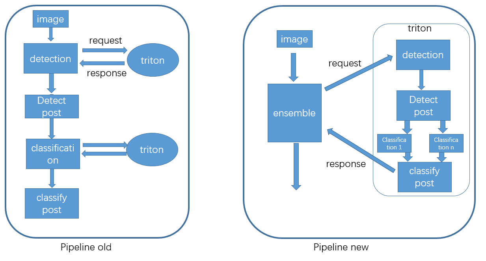
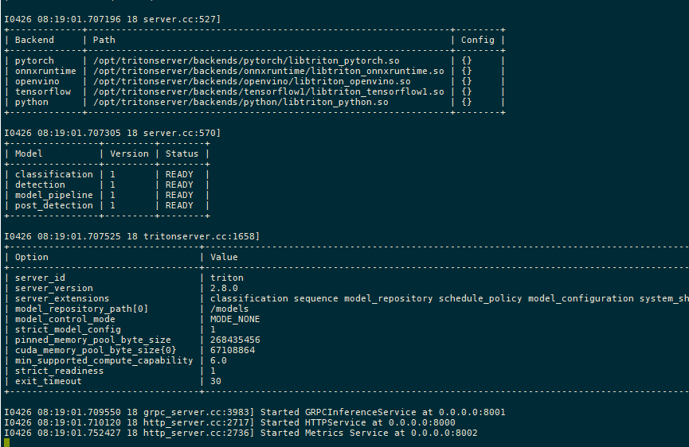
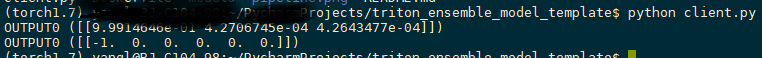

# triton_ensemble_model_template

## Pipeline algorithms in client(left) vs Pipeline algorithms in triton (right)

## ensemble model

input: raw image
output: bboxes, classification info. (if there no object in image, not return empty, return a specified value)

input image-->detection--> post_detection: filter object and crop object and preprocess for classification --> classification -->  post_classification

In this template i want detect person and distinguish whether they are wearing vest.

### detection model

The detection model is yolov5.pytorch, export to model.onnx, input-size:640, detect two class: person and head, in this demo, only use person [my yolov5](https://github.com/yl305237731/flexible-yolov5)

### post detection model

The post detection model, write by python backend, first, get detection bboxes, then, according to origin input image and detection bboxes to crop person, and format every crop image to classification input.

*notice: In order to prevent the subsequent classification error caused by no person in detection result, a random image is appended at the end of the crop image list.*

### classification model

The classification model is efficient-net.keras, input-size: 260, return 3 class, background, wear vest, no wear vest.

### post classification

The post classification model. In this demo, only use one classification mode, so not implementation this. 

### result

